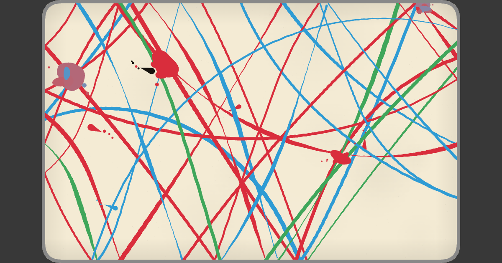

# Zen Pong

A pong match that paints. Every rally leaves a piece of generative art.

**[Play it live →](https://shivang-xyz.github.io/zen-pong/)**



## What it is

Zen Pong is regular pong with a twist: the ball's path is the point. Play a
short match on one of three surfaces — **paper**, **chalkboard**, or
**paint** — and the trail it leaves behind becomes a finished piece of
generative art you can save or share as a link.

- **Three surfaces**, each with its own physics-adjacent rendering: paper's
  fine ink lines, chalkboard's chalky texture, paint's wet ribbon strokes
  and splatter.
- **Every palette is generated**, not picked from a fixed set — real hue
  rotation in OKLCh colour space, so no two shuffled games look alike.
- **Share your painting** as a self-contained link — no server, no
  database, the whole artwork is encoded into the URL.
- **All sound effects are synthesised** in real time with the Web Audio
  API — no sample files. The background music is a real licensed
  soundtrack (see Credits).

## How it's built

This is the interesting part. Zen Pong ships as **one self-contained HTML
file** — pure vanilla JavaScript, no external libraries, no build
framework, no dependencies. Open `index.html` in a browser and it runs.

That single-file constraint is real, but the *source* isn't written that
way: a small Node generator (`v3/build.js`, zero dependencies) inlines a
set of headless engine modules into one script at build time, so the
engine stays the single source of truth — tuned once, shipped everywhere —
while the shipped product stays exactly one portable file.

Everything else is built from first principles on top of that: the canvas
is a fixed 1000×630 surface with rounded corners; the paddles are real DOM
`<div>` elements (not canvas-drawn) so they get free CSS transitions and
hit-testing; every sound — paddle hits, wall bounces, points, the chalk
scratch, the results bell — is synthesised on the fly through the Web
Audio API.

## Repo layout

```
v3/engine/    the headless, seedable engine — physics, rendering, palette
              generation. Pure functions, zero DOM access, deterministic
              given a seed. The single source of truth.
v3/app/       the product — v3/app/index.html is what actually ships,
              built against the engine above.
v3/labs/      the art lab — a calibration tool for tuning the engine's
              generative parameters before they get frozen into the
              product. Not shown to players.
v3/briefs/    the build history — every brief that shaped this project,
              in order (see v3/briefs/README.md for the index).
v3/build.js   generates the root index.html below from v3/app/ + v3/engine/.
index.html    GENERATED — the actual shipped game. Never hand-edited;
              regenerate with `node v3/build.js` after any engine or app
              change.
```

## Credits

- **Music** — "Oolong" and a second track by [Omni Gardens](https://omnigardens.bandcamp.com/album/moss-king-2),
  used under permission. See the licence note below — the soundtrack is
  not covered by this repository's licence.
- **Fonts** — DM Serif Display, Space Mono (Google Fonts), Basier Circle
  (self-hosted, `fonts/`).
- **Built** by Shivang, directed brief by brief with Claude — every
  feature in `v3/briefs/` started as a written spec before a line of code
  changed.

## Licence

Three separate things, three separate answers:

1. **The code** is All Rights Reserved — see [LICENSE](LICENSE). It's
   public for portfolio/demonstration purposes; no reuse, modification, or
   redistribution rights are granted.
2. **Your artwork.** Any painting you generate by playing is yours — save
   it, share it, post it, do what you like with it. No rights reserved on
   player-generated pieces.
3. **The music is not mine to license.** It belongs to Omni Gardens and is
   used here under permission, entirely outside the scope of this repo's
   code licence. Don't extract or redistribute the audio files separately
   from this project.
